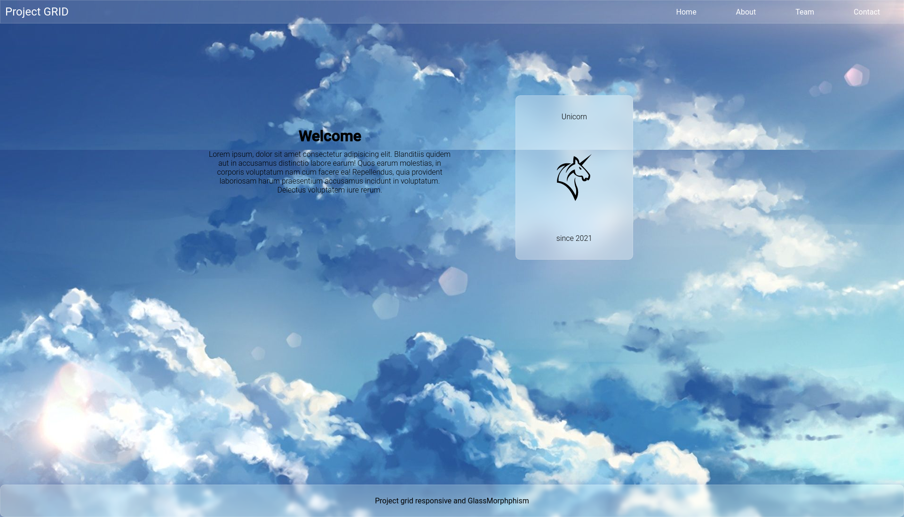
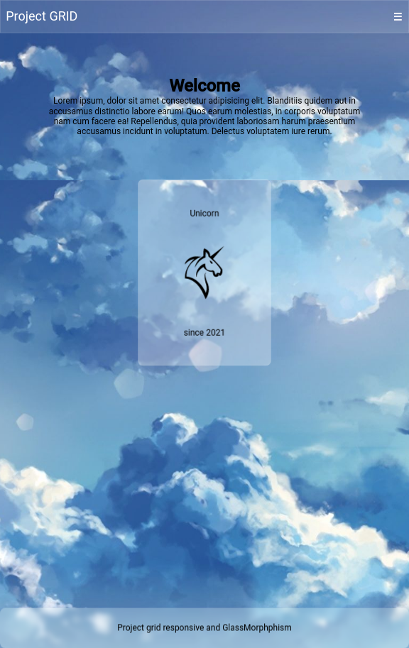

## Example Grid layout responsive.

Use `yarn dev`, to start project with live server. 

 

## Conclusões do projeto

- Com grid, é muito mais fácil criar um layout responsivo.

- Utilize sempre o `@media(min-width: xxx){}`, assim fora desse escopo você desenvolve pensando no mobile first.

- Com a dica a cima, comece a estilizar o CSS fora do escopo do `Media Query` para ter um estilo global, quando for necessário para o desktop, inclua no media setado.

- Utilizando `grid-template-columns: repeat(12, 1fr)` com ` grid-column: span X` você substitui o sistema de grid inteiro do Bootstrap.

- É muito mais víavel criar seu próprio "sistema de grid" por não depender das classes do Bootstrap.

- Utilizar SCSS no próximo projeto, assim o código fica menos sujo e fácil de dar manutenção, provavelmente seguindo o SMACSS ou BEM.

- Utilizar o [Responsively](https://responsively.app/) ajuda quem deseja focar no mobile first.

- GlassMorphism é fácil, você pode posicionar qualquer elemento se for necessário deixando a classe mãe com `position: relative` e sua div ou img svg com `position: absolute`.

- Flex GRID é para montar o layout, Flex BOX se utiliza para alinhar.

